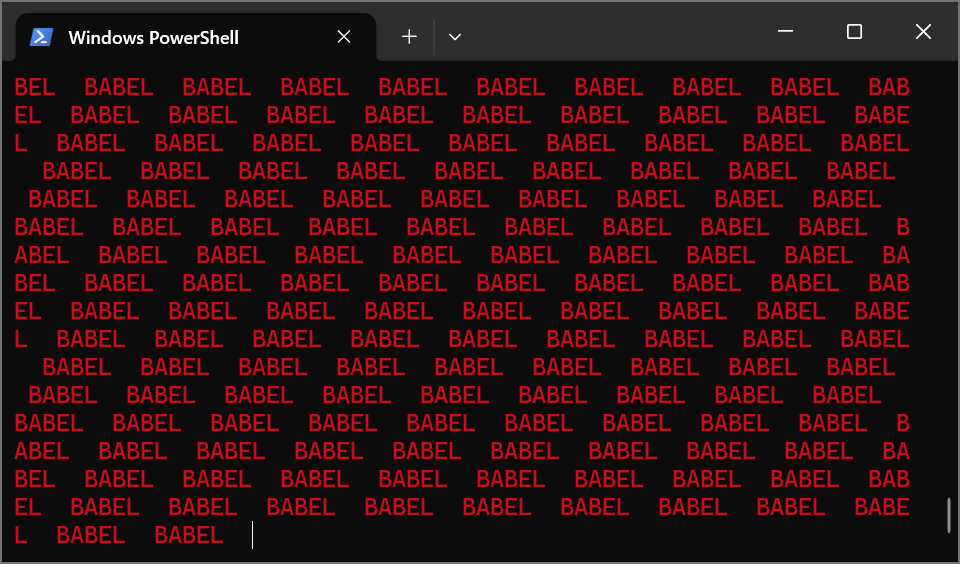
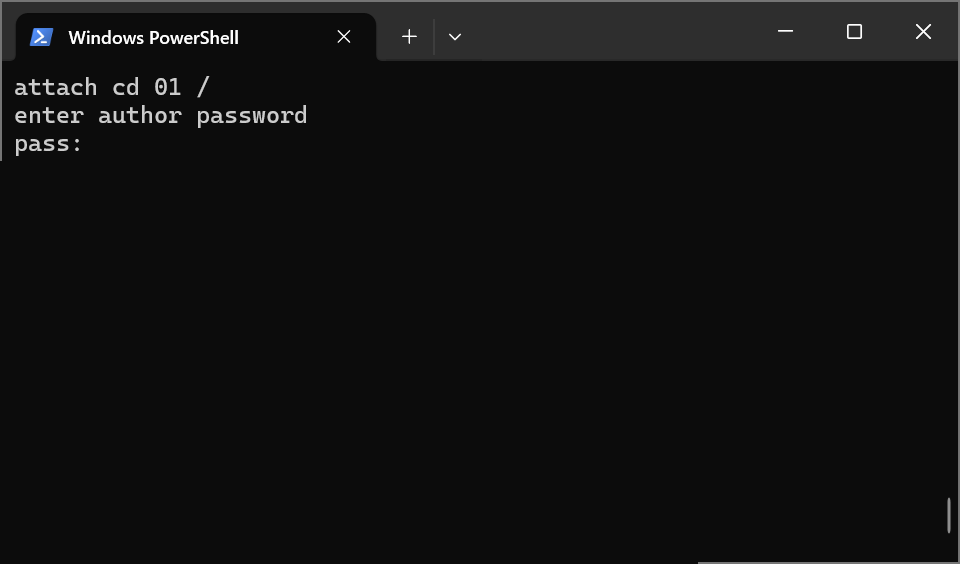

# BABEL
<!-- pandoc -f markdown -t html5 -o README.html -c ./github.css README.md -->

先日から YouTube で、パトレイバーシリーズが1日1本限定公開されている。  
数日前の配信を見て、印象的なあの場面をtinygoで再現してみた。  

  

raspi picoをターゲットとして作成しているが、特殊な事はしていないので、他のマイコンボードでも同じ様に動作するはずである。  
tinygoで開発を始めたが、コードを見直してみると、文字列の入力と表示の基本的な機能しか使っていないなかった。  
そこで、少し手直しをして、フルセットのgoでも動くバージョンも作成した。

### コンパイル方法  

#### tinygo version  

ソースコードは、[./TinyGo/main.go](./TinyGo/main.go) である。  
このソースコードのあるディレクトリに移動して、以下のコマンドを実行する。  
ここでは、 raspi picoをターゲットにしているが、他のマイコンボードを使用する場合は、そのマイコンボードに合わせて、ターゲット名を変更すること。  
コンパイルが完了すると、生成した実行用バイナリがマイコンボードに転送される。  

```bash
> cd tinygo
> tinygo flash --target pico --size short -monitor .
```

また、実行用バイナリを転送できない場合は、以下のコマンドで実行用バイナリを作成し、手作業で、実行用バイナリをマイコンボードに転送する。  

```bash
> tinygo build -o BABEL.uf2 --target pico --size short .
```

パッケージのバージョン等に起因する問題が発生する場合は、モジュールの依存関係を管理するmodファイルを初期化すること。  

```bash
> go mod init main
> go mod tidy
```

#### Fullset go version

ソースコードは、[./FullsetGo/main.go](./FullsetGo/main.go) である。  
このソースコードのあるディレクトリに移動して、以下のコマンドを実行する。  
コンパイルが完了すると、生成した実行用バイナリがマイコンボードに転送される。  

```bash
> cd tinygo
> go run .\main.go
```


また、実行ファイルを生成するには、以下のコマンドを実行する。  
その後、生成した実行ファイルをコマンドラインから実行する。  

```bash
> go build -o BABEL.exe .\main.go
> .\BABEL.exe
```

パッケージのバージョン等に起因する問題が発生する場合は、モジュールの依存関係を管理するmodファイルを初期化すること。  

```bash
> go mod init main
> go mod tidy
```

### 使用方法

起動すると、以下の画面が表示されるので、あとは、パスワードを入力するだけ！！

  


