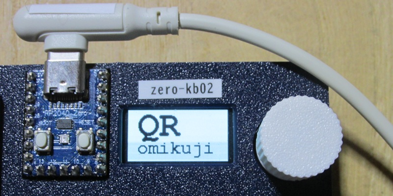
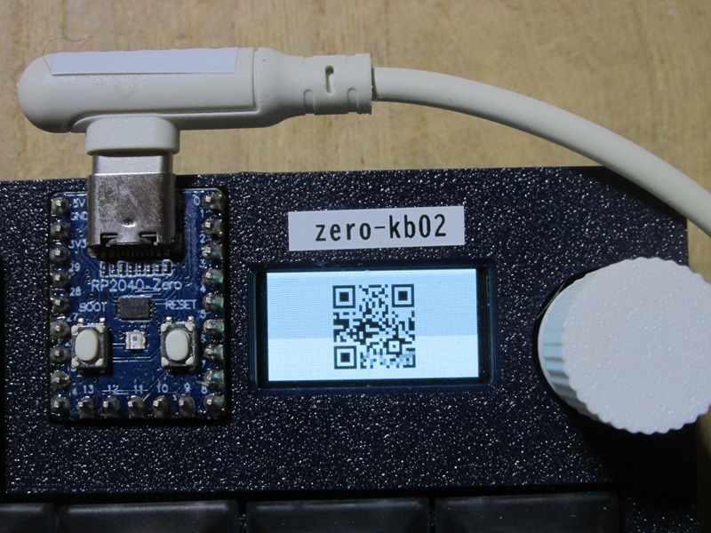
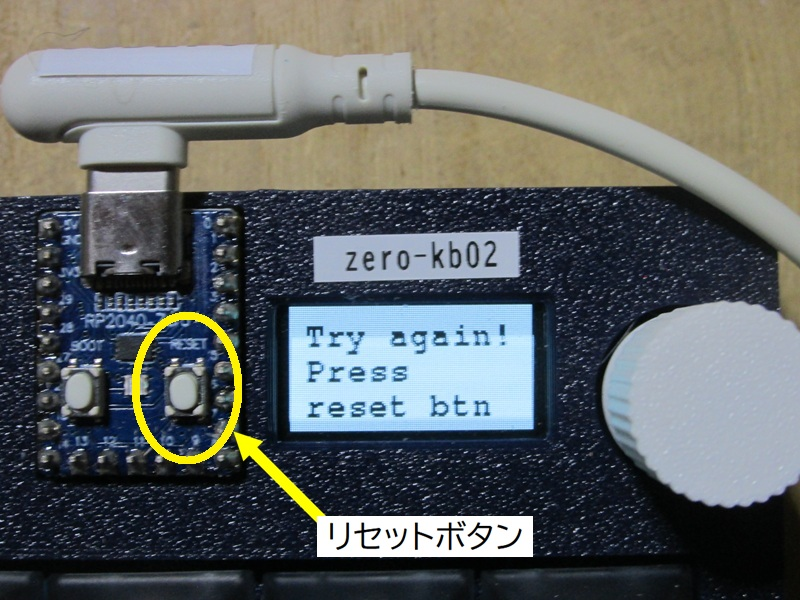

# QR おみくじ



御神託をQRコードでOLEDディスプレイに表示する**おみくじ**です。  
NHK Ｅテレの朝の番組**０６５５**の「たなくじ」(月曜日限定コーナー)をヒントに作成しました。  
[Eテレ0655&2355](https://ja.wikipedia.org/wiki/E%E3%83%86%E3%83%AC0655%262355)

### コンパイル方法  

必要に応じて、以下のパッケージの導入して下さい。  

```bash
> go get -u github.com/skip2/go-qrcode/...
> go get tinygo.org/x/drivers
> go get tinygo.org/x/tinydraw
> go get tinygo.org/x/tinyfont
> go mod tidy
```

ソースコードは、[main.go](main.go) です。  
このソースコードのあるディレクトリに移動して、以下のコマンドを実行して下さい。コンパイルが完了すると、生成した実行用バイナリがマイコンボードに転送されます。  

```bash
> tinygo flash --target waveshare-rp2040-zero --size short -monitor .
```

また、実行用バイナリを転送できない場合は、以下のコマンドで、実行用バイナリを作成し、手作業で、実行用バイナリをzero-kb02に転送して下さい。  

```bash
> tinygo build -o dispQRcode.uf2 --target waveshare-rp2040-zero --size short .
```

### 使い方

1. 起動すると、御神託が埋め込まれたQRコードをランダムにOLEDディスプレイに表示します。  


2. スマホ等のQRコードリーダーで読み取って下さい。  

3. 約30秒間、表示を繰り返し、自動停止します。  
4. 繰り返し実行したい場合は、マイコンボードrp2040-zeroの物理リセットボタンを押して下さい。  


### 解説

啓示する御神託は、京都 [伏見稲荷大社](https://inari.jp/)のおみくじをお手本にしています。  
伏見稲荷大社のおみくじの吉凶の順番は、以下の通りです。  
同じ神託でも、教えが複数種類あるものが存在するので、合計で32種類あります。  

| 神託           | 読み                               | 種類 |
|:---------------|:-----------------------------------|:----:| 
| 大大吉         | だいだいきち                       |   2  |
| 大吉           | だいきち                           |   6  |
| 凶後大吉       | きょうのちだいきち                 |   2  |
| 凶後吉         | きょうのちきち                     |   4  |
| 末大吉         | すえだいきち                       |   3  |
| 末吉           | すえきち                           |   2  |
| 向大吉         | むかうだいきち                     |   2  |
| 吉             | きち                               |   2  |
| 中吉           | ちゅうきち                         |   1  |
| 小吉           | しょうきち                         |   1  |
| 小凶後吉       | しょうきょうのちきち               |   1  |
| 後吉           | のちきち                           |   1  |
| 吉凶未分末大吉 | よしあしいまだわからずすえだいきち |   1  |
| 吉凶不分末吉   | きちきょうわかたずすえきち         |   1  |
| 吉凶相半       | きちきょうあいなかばす             |   1  |
| 吉凶相交末吉   | きちきょうあいまじわりすえきち     |   1  |
| 吉凶相央       | きちきょうあいなかばす             |   1  |

占い結果の詳細については、以下のサイトを御覧ください。  

https://xn----h36a23lx0pugj6v2avtnvol.jinja-tera-gosyuin-meguri.com/%E3%80%8C%E5%A4%A7%E5%A4%A7%E5%90%89%E3%80%8D%E3%81%8C%E3%81%82%E3%82%8B%E5%99%82%E3%81%AE%E3%82%AD%E3%83%84%E3%83%8D%E3%81%8A%E3%81%BF%E3%81%8F%E3%81%98%EF%BC%81%E4%BA%AC%E9%83%BD%E3%83%BB%E4%BC%8F/%E3%80%8C%E5%A4%A7%E5%A4%A7%E5%90%89%E3%80%8D%E3%81%8C%E3%81%82%E3%82%8B%E5%99%82%E3%81%AE%E3%82%AD%E3%83%84%E3%83%8D%E3%81%8A%E3%81%BF%E3%81%8F%E3%81%98%EF%BC%81%E4%BA%AC%E9%83%BD%E3%83%BB%E4%BC%8F/.html
