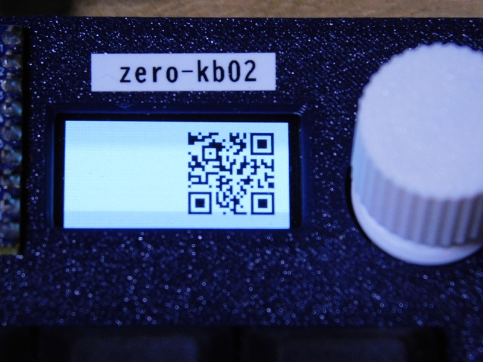

# dispQRcode
<!-- pandoc -f markdown -t html5 -o README.html -c ../github.css README.md -->

マイクロパッド[zero-kb02](https://github.com/sago35/tinygo_keeb_workshop_2024/blob/main/buildguide.md) のOLEDディスプレイに、QRコードを表示します。  
1セルを2x2ドットでQRコードを表示しています。  

  

### コンパイル方法  

必要に応じて、以下のパッケージの導入して下さい。

    > go get tinygo.org/x/drivers
    > go get tinygo.org/x/tinydraw
    > go get tinygo.org/x/tinyfont
    > go mod tidy

ソースコードは、[main.go](main.go) です。  
このソースコードのあるディレクトリに移動して、以下のコマンドを実行して下さい。コンパイルが完了すると、生成した実行用バイナリがマイコンボードに転送されます。  

    > tinygo flash --target waveshare-rp2040-zero --size short -monitor .

また、実行用バイナリを転送できない場合は、以下のコマンドで、実行用バイナリを作成し、手作業で、実行用バイナリをzero-kb02に転送して下さい。  

    > tinygo build -o dispQRcode.uf2 --target waveshare-rp2040-zero --size short .

### 格納する文字について

QRコードのセルは、2x2ドットで構成しており、生成できるのは、以下の2つのバージョンです。

* version 1(21x21)
* version 2(25x25)

これより大きいサイズであるversion 3(29x29)では、ギリギリ表示は可能ですが、周辺の余白がない状態なので、読み込みができません。
よって、利用できるのは、version 2に収まる文字数となります。
表示可能な文字は、凡そ以下の通りです。

* 数字のみ  40文字
* 英数字    30文字
* 全角文字  10文字

上記の文字数の範囲で、ソースコードの変数 str に定義された文字がQRコードとして表示されます。  
この部分を表示したい文字列に書き換えて下さい。  

### 技術的問題点とその打開策について

前項で示したように、数十文字程度しか表示できないので、簡単なメッセージしか表示できません。使用しているOLEDディスプレイの表示エリアが128x64ドットなので、これが限界です。  
英数字だと、20数文字程度なので、埋め込める情報量は限られますが、あまり長くないURLなら、なんとかなりそうです。  
例えば、GitHubProfile へのリンクを埋め込んでおけば、名刺代わりに使えるのではないでしょうか？  

* https://docs.github.com/ja/account-and-profile/how-tos/profile-customization/managing-your-profile-readme
* https://zenn.dev/yutakatay/articles/kirakira-github-profile

もっと多くの情報を表示したい場合は、どうすればよいでしょうか？

**制約あれば、対策あり**

さらに多くのデータを表示するには、**連結QRコード**を使うことで、解決できるかもしれません。  
**連結QRコード**は、1つの大きなデータを複数のQRコードに分割して保存し、それらをすべて読み取ることで元のデータに復元する機能です。
最大16個に分割できます。  
この分割して生成したQRコードを順次表示し、それを順番に読み込んでもらう仕様にすれば、多くの情報を提供できるかもしれません。  
