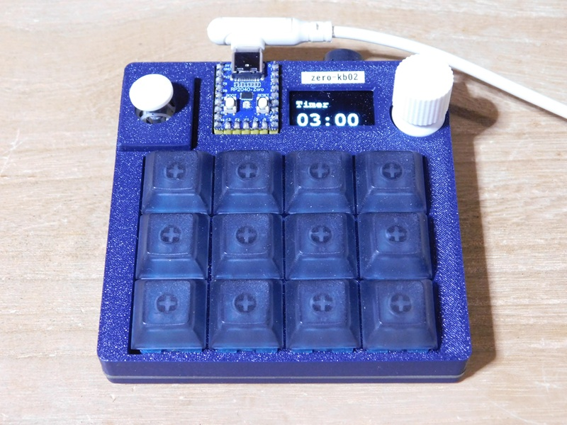
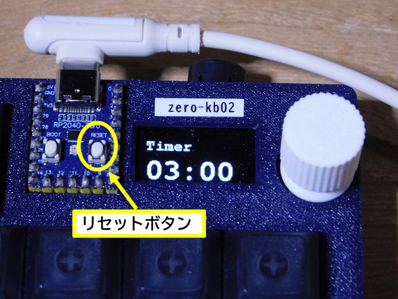
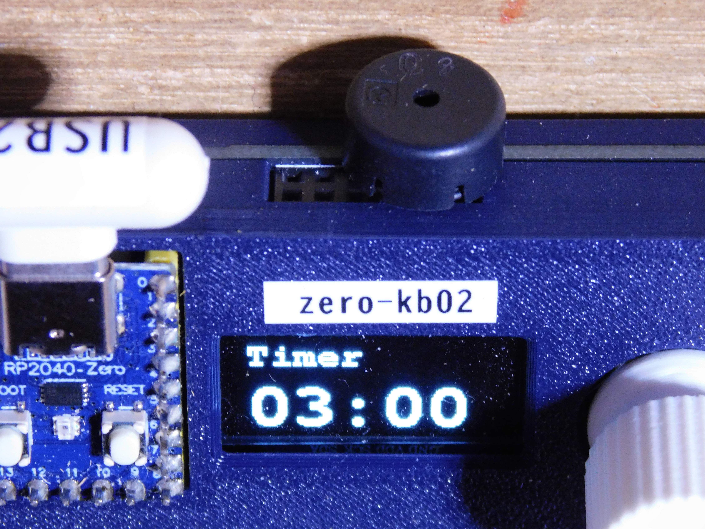

# タイマー



シンプルなカウントダウンタイマーです。  

* 初期設定は、5分に設定されています。
* ロータリーエンコーダを回すと、設定時刻を変更できます。設定時間は、1秒単位で最大99分99秒まで設定できます。
* ロータリーエンコーダのトップを押すと、カウントダウンをスタートし、もう一度押すと、一時停止します。
* 一時停止中に、ロータリーエンコーダを押すと、カウントダウンを再開します。
* カウントダウンが終わると、停止して終了音を鳴らします。
* ロータリーエンコーダのトップを長押しすると、スタート時の設定時刻を再設定します。
* リセット機能は、実装していません。マイコンボードの **リセットボタン** を押して下さい。



## ハードの追加

zero-kb02 には、ブザー出力がありません。  
背面のコネクターに、以下のような[圧電スピーカー](https://akizukidenshi.com/catalog/g/g104118/)(圧電サウンダー)を接続して下さい。  



今回のサンプルでは、GPIO15とGNDに圧電スピーカーを接続しています。  
この部分の設定は、使用するハードやパーツに合わせて、修正して下さい。  

### コンパイル方法  

必要に応じて、以下のパッケージの導入して下さい。  

```bash
> go get tinygo.org/x/drivers
> go get tinygo.org/x/drivers/tone
> go get tinygo.org/x/tinydraw
> go get tinygo.org/x/tinyfont
> go mod tidy
```

ソースコードは、[main.go](main.go) です。  
このソースコードのあるディレクトリに移動して、以下のコマンドを実行して下さい。コンパイルが完了すると、生成した実行用バイナリがマイコンボードに転送されます。  

```bash
> tinygo flash --target waveshare-rp2040-zero --size short -monitor .
```

また、実行用バイナリを転送できない場合は、以下のコマンドで、実行用バイナリを作成し、手作業で、実行用バイナリをzero-kb02に転送して下さい。  

```bash
> tinygo build -o timer.uf2 --target waveshare-rp2040-zero --size short .
```

### 追加機能

終了音に、某大手ハンバーガーチェーンで、ポテトが揚がったときに店内で流れるタイマー音を加えました。  

[ティロリサウンド](https://www.youtube.com/watch?v=8NjhfastLts)

ソースコード中のmain()関数内にある終了音の部分をendSound(speaker) からthiroriSound(speaker)に書き換えて、コンパイルして下さい。  

```go
// 終了音
    endSound(speaker) // 終了音（近）(4)
//	thiroriSound(speaker) // 終了音 thirori
```

### 応用例

このタイマーは、デフォルトで3分間に設定してあります。  
カップ麺にお湯を入れて、出来上がるまでの待ち時間の測定にピッタリですね。  
なお、カップ麺が3分なのは、技術的に1分でも作れるが、3分が最もおいしく麺がのびず、具材とのバランスが良い「ゴールデンタイム」ということです。  

